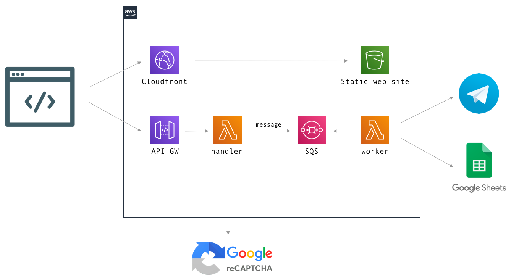

# =formuljar=

[](https://github.com/maslick/formuljar/actions)
[](https://opensource.org/licenses/MIT)

a simple web form with extra security

## :rocket: Features
* Google reCaptcha v3 (server-side verification) :boxing_glove:
* Integration with Telegram (notifications) :8ball:
* Integration with Google Spreadsheets (audit) :jigsaw:
* Serverless framework on AWS: API GW, Lambda, SQS, S3, Cloudfront :heart:

<br>

## :bulb: Motivation
Often times businesses need a simple static web form to get user feedback and/or generate sales leads, so that users
fill out a web form with their contact data.
The business then needs to get a notification (e.g. via Telegram) and store user info in a document (e.g. Google Spreadsheets).

The integration part with 3rd party services is pretty much straightforward. However, several **challenges** may arise:

### :one: Your backend server may be overloaded :no_good: by a number of automated requests :bomb:

An attacker :male_detective: (e.g. your competitor) may get the form handler URL and issue a number of dummy ``POST`` requests, thus making your backend send a lot of notifications and polluting your spreadsheet with fake data.
Here we can use **reCaptcha** to process only the requests produced by a human.

### :two: You may need to process requests asynchronously :ping_pong: and respond immediately! :horse_racing:
You don't want your users to wait!
Integration with 3rd party services such as Telegram, Spreadsheets, etc. may take some time, so you need to decouple the web request and business logic by using a message queue (e.g. AWS SQS).

### :three: Your solution should scale well :satellite:
Hosting on Heroku for $7/month is a good option, but it doesn't scale well. Better use Serverless on AWS with almost infinite scaling capabilities.

### :four: Your solution should be cheap! :money_with_wings:
You could host your app on Heroku. There are 2 options here: a free plan (limited availability, no custom domain, no TLS) or a Hobby plan ($7 per dyno per month). However, there is a better hosting solution which is almost free, and that is - AWS :ok_hand:


## :white_check_mark: Installation
### :spades: reCaptcha
1. Go to https://www.google.com/recaptcha/admin and create a new site.
2. Go over to Settings and copy both ``CAPTCHA_PUBLIC`` and ``CAPTCHA_SECRET``.
3. Add necessary domains where you want to use reCaptcha (e.g. ``d2dc90ktgsfnzk.cloudfront.net``, ``localhost``, ``formuljar.maslick.ru``).

### :hearts: Telegram 
1. Send a new message to @BotFather: ``/newbot``. 
2. Give your bot a name (e.g. ``Formuljar``). 
3. Choose a username for your bot (e.g. ``formuljar_bot``). 
4. You will get a ``TELEGRAM_BOT_TOKEN`` (e.g. ``1234567890:ABCdefgHijklmnoPQrsTUVwXyZ``).
5. You can also set a profile pic by issuing ``/setuserpic``. 
6. Create a channel. Set its type to private and invite your bot (e.g. ``@formuljar_bot``) as admin 👩‍💼 with the ability to post messages. 
7. Start a conversation with ``@getidsbot``. 
8. Write a sample message into your channel and forward it to ``@getidsbot``. 
9. Switch to @getidsbot and find your ``TELEGRAM_CHAT_ID`` (Origin chat -> id): e.g. ``-1001375717457``.

### :clubs: Google Spreadsheets
1. Log in to GCP console https://console.cloud.google.com/
2. Create a new project.
3. Enable ``Google Sheets API``.
4. Click Manage and head over to Credentials. Create a new service account.
5. Create a new API key. Download the JSON. Copy the JSON into the ``GOOGLE_CREDENTIALS`` env. variable.
6. Create a new Spreadsheet and Share the document with your service account email (see JSON -> ``client_email``).
7. Get the id of your document (e.g. https://docs.google.com/spreadsheets/d/1JnW6kWGL-Xily71-xxxxxx-Bw_lfW2Lb_SyCjx3uBTyQ -> ``1JnW6kWGL-Xily71-xxxxxx-Bw_lfW2Lb_SyCjx3uBTyQ``). This will be your ``SPREADSHEET_ID`` env. variable.

### :diamonds: Serverless
```
$ export CAPTCHA_PUBLIC=...
$ export CAPTCHA_SECRET=...
$ export TELEGRAM_CHAT_ID=...
$ export TELEGRAM_BOT_TOKEN=
$ export GOOGLE_CREDENTIALS=...
$ export SPREADSHEET_ID=...
$ export SHEET_NAME=...

$ npm i -g serverless
$ sls config credentials --provider aws --key <key-id> --secret <secret>
$ sls deploy --stage prod --verbose
```
